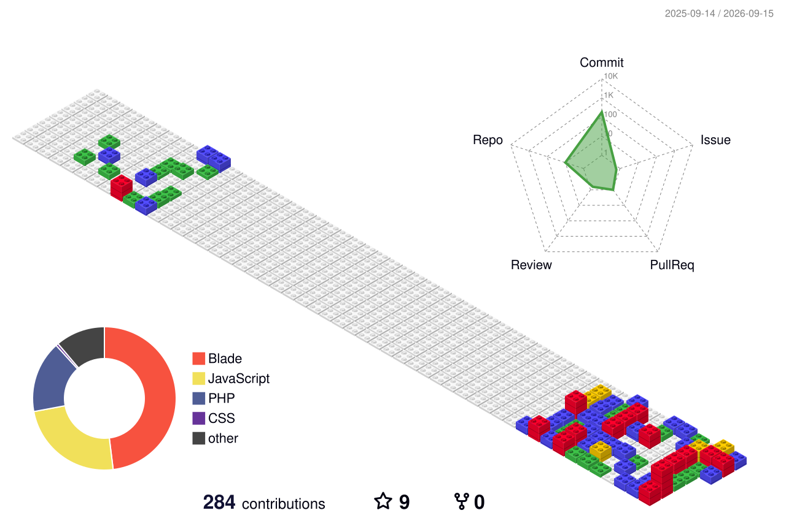

<h1 align="center">Hi there, I'm Alief 👋</h1>

I build modern, responsive, and user-focused web applications.

Passionate about turning ideas into functional digital experiences and solving real-world challenges through elegant engineering.

---

## 👨‍💻 About Me

I'm a passionate **Web Developer** who enjoys building modern web applications, exploring new technologies, and solving real-world problems with clean, scalable code.

My focus revolves around writing maintainable codebases, designing intuitive UI/UX systems, and building robust backend services. I believe great software bridges thoughtful design with solid engineering ergonomics.

- 💼 Availability: Freelance / Full-Time Roles
- ⚡ Superpower: Quick turnaround & clean UI

## 🖥️ Tech & Tools
 

## 🚀 Featured Projects

| Project | Description | Stack |
|---|---|---|
| **QuickMenuQR** | QR-based ordering system — customers scan a QR code to order, orders sync live to kitchen & cashier, and diners can track order status in real time (pending, cooking, ready) plus other supporting features. | Laravel • React |
| **KostHub** (Backend + Frontend) | Property / boarding house management system for owners, staff, and tenants. | PHP • JavaScript |
| **Stockify** | Inventory / stock management system. | Blade (Laravel) |
| **KasirPintar** | Point-of-sale (cashier) system. | Blade (Laravel) |
| **WarungNasiBuYati** | Small business website / ordering system. | Blade (Laravel) |

## 📊 GitHub Overview

<picture>
  <source media="(prefers-color-scheme: dark)" srcset="./profile-3d-contrib/profile-night-rainbow.svg" />
  <source media="(prefers-color-scheme: light)" srcset="./profile-3d-contrib/profile-gitblock.svg" />
  
</picture>

## 🌱 Currently Learning
- ⚛️ React & Next.js Server Components
- 🧩 Laravel Microservices & Clean Architecture
- 🔗 RESTful API Standards & GraphQL
- 🗄️ Database Indexing & Query Optimization
- 🎨 UI/UX Design Systems in Figma
- 🔧 Advanced Git Workflow & CI/CD Pipelines

## ⚡ What I'm Working On
- 🔨 Building full-stack web applications for clients
- 📚 Learning modern web technologies and testing suites
- 🎨 Refining interaction ergonomics and developer UX
- 🚀 Shipping open source utilities and code templates
- 🤝 Open to collaboration on developer tooling

> "Code is not just about solving problems, it's about creating useful experiences."

## 📫 Let's Connect

